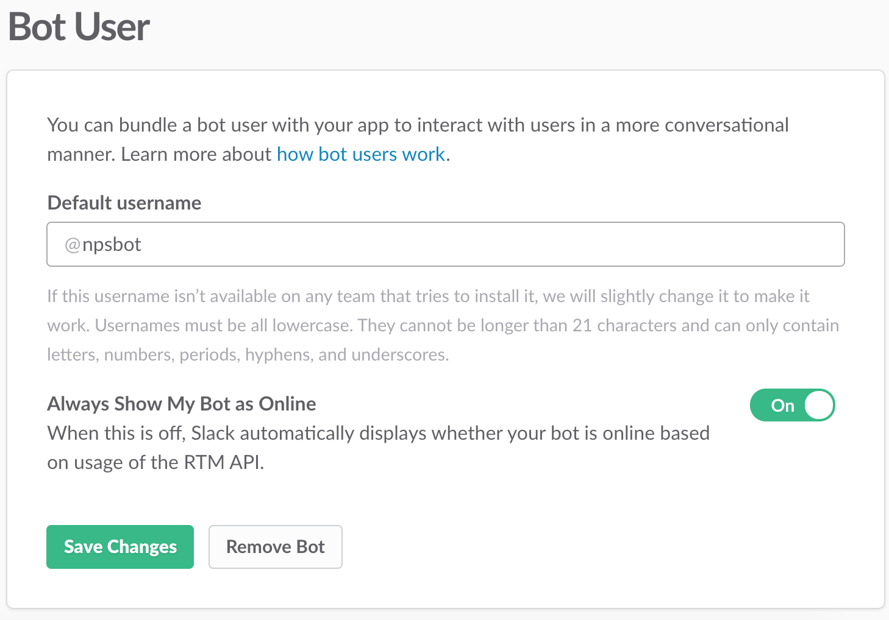
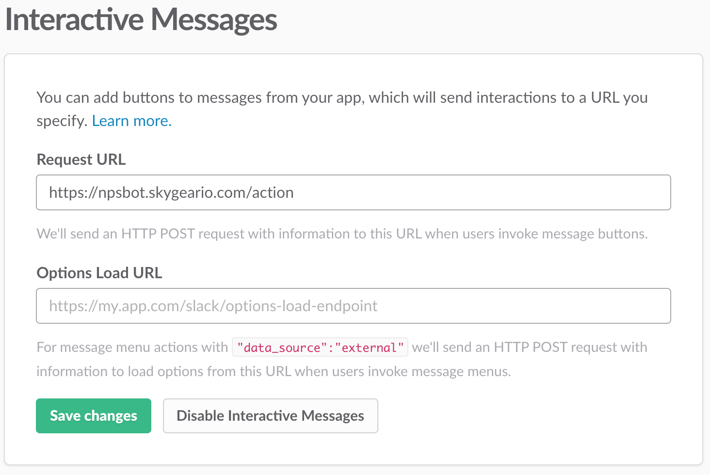
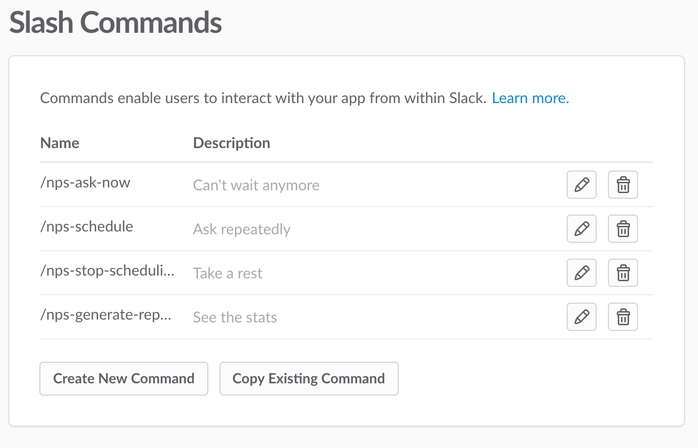
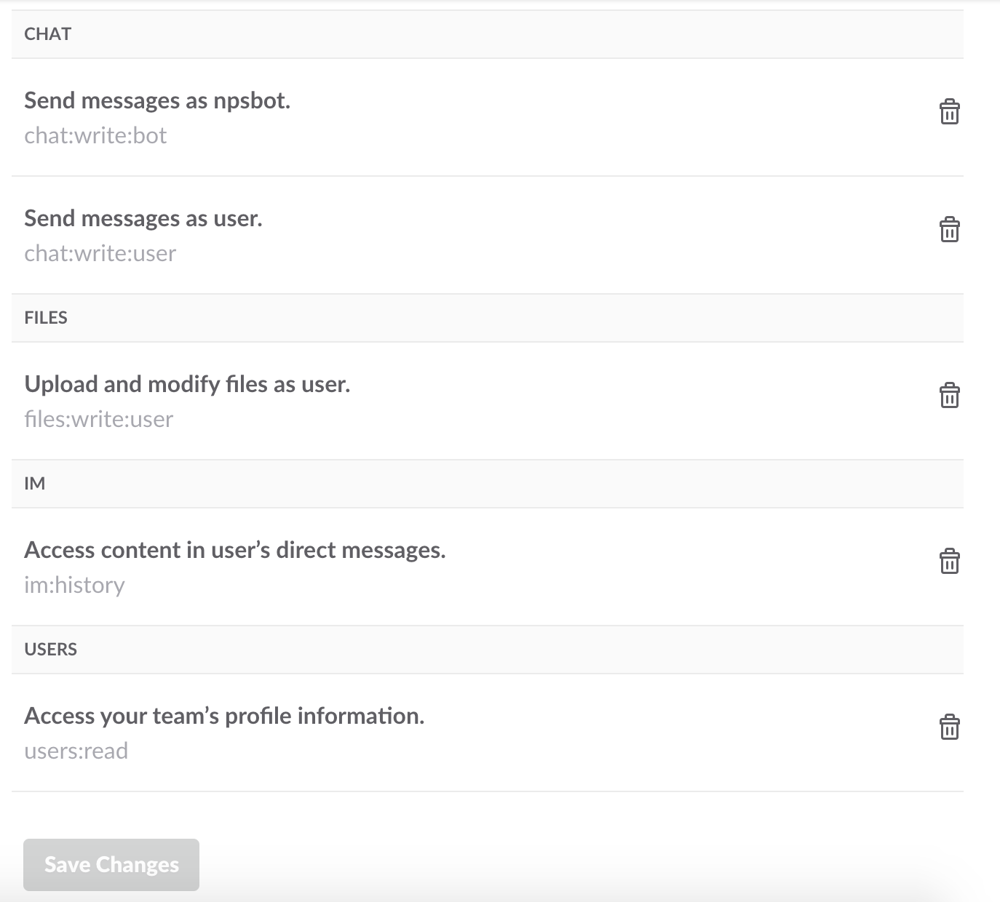
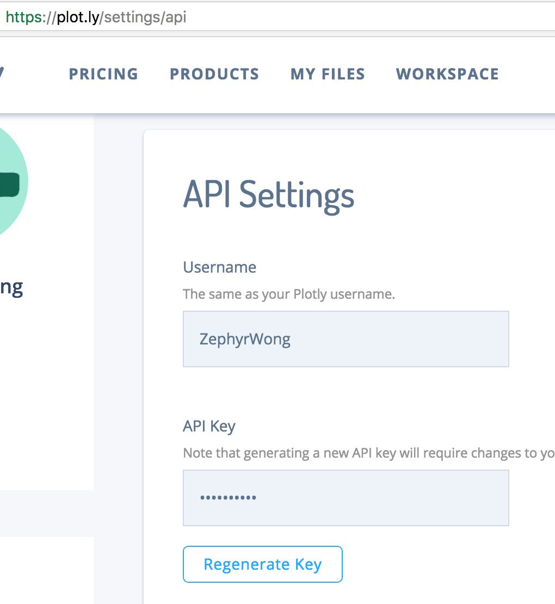
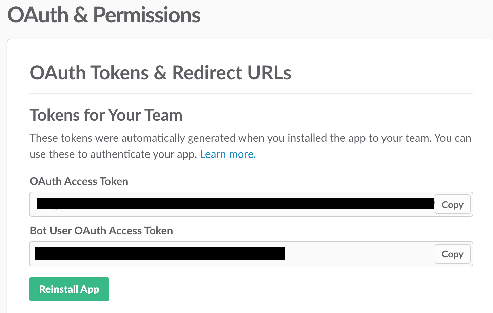
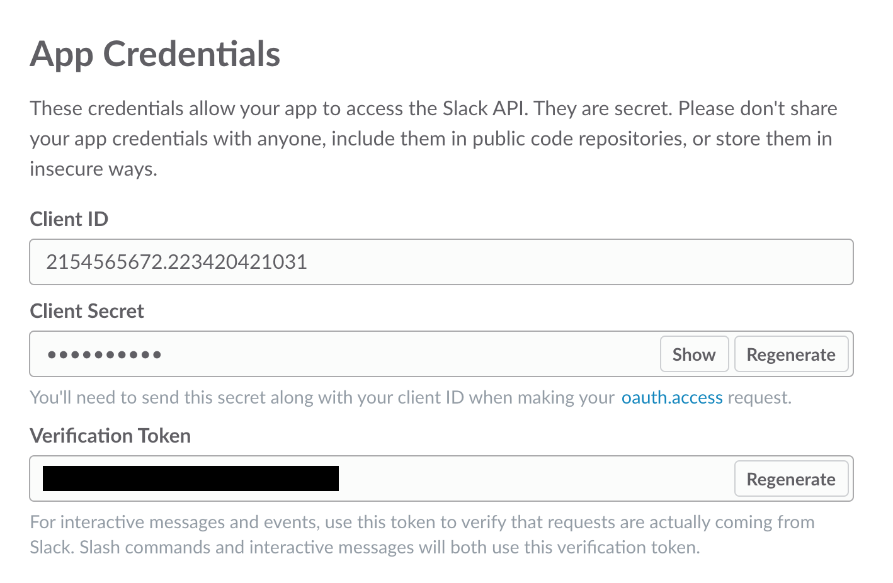

# Installation Guide

## Plotly
1. Sign up

## Slack
1. Create a Slack app
2. Enable "Bot User", toggle on "Always Show My Bot as Online"

    
3. Enable "Interactive Messages", set "Request URL" to `your-skygear-endpoint`/action

    
4. Enable "Slash Commands", create following commands and set each "Request URL" to `your-skygear-endpoint`/command

    
5. Permit following scopes in "OAuth & Permissions"

    

## Skygear
1. Sign up
2. Create an app
3. Add following environment variables in Settings/Advanced
    * `APP_IS_ON`: true
    * `DEVELOPMENT_MODE`: false
    * `PLOTLY_API_KEY`

        
    * `PLOTLY_USERNAME`
    * `SLACK_BOT_TOKEN`

        
    * `VERIFICATION_TOKEN`

        
4. Add your ssh key in "Manage Your Account"
5. `git clone` this project
6. `git remote add` your skygear cloud function endpoint
7. Push to server
8. Wait a minute and `curl` the endpoint to check availability

## Slack (after your skygear app gets ready)
6. Enable "Event Subscriptions", set "Request URL" to `your-skygear-endpoint`/event
7. Add a "Bot User Event": `message.im` (Not "Team Event"!)
8. Install the app to your team
